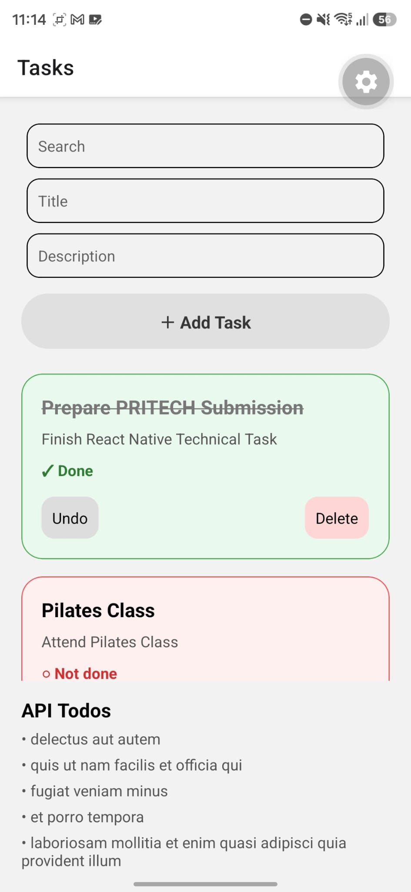
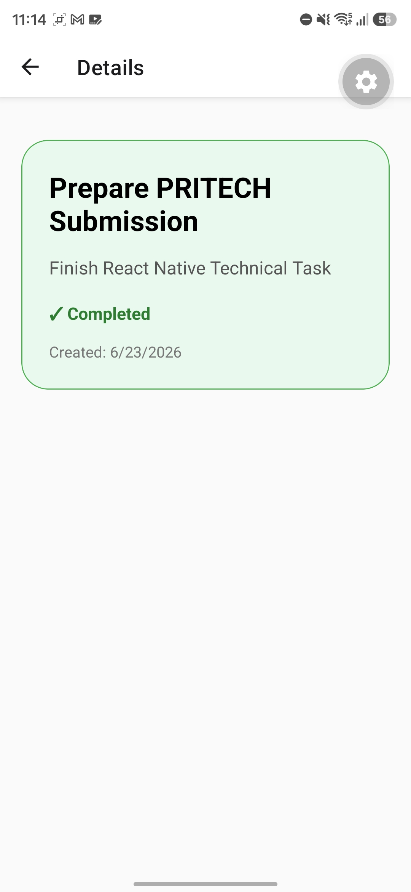

# Task Manager App

A React Native mobile application for creating and managing personal tasks.

Built as part of the PRITECH React Native technical challenge.

## Screenshots

### Task List




### Task Details




## Features

- Create new tasks
- Add task title and description
- Mark tasks as completed or pending
- Delete tasks
- View task details
- Input validation
- Search tasks by title
- Store tasks locally with AsyncStorage
- Fetch and display data from a public API
- Navigate between screens


## Tech Stack

- React Native
- Expo
- TypeScript
- React Navigation
- AsyncStorage
- REST API
- FlatList


## App Structure

```text
src
│
├── components
│   └── TaskItem.tsx
│
├── screens
│   ├── TaskListScreen.tsx
│   └── TaskDetailsScreen.tsx
│
├── services
│   └── api.ts
│
├── storage
│   └── taskStorage.ts
│
└── types
    └── Task.ts
```


## Screens

### Task List

The main screen where users can:

- Create tasks
- Search tasks
- Complete tasks
- Delete tasks
- View API todos


### Task Details

Shows detailed information about a selected task:

- Task title
- Task description
- Completion status
- Creation date


## API Integration

The application fetches todo data from:

JSONPlaceholder API

https://jsonplaceholder.typicode.com/todos

Fetched API data is displayed inside the application to demonstrate REST API integration.


## Local Storage

Tasks are stored locally using AsyncStorage.

This allows created tasks to remain available after closing and reopening the application.


## Running the Project

Clone the repository:

```bash
git clone https://github.com/anitamje/react-native-task-manager
```

Navigate into the project folder:

```bash
cd react-native-task-manager
```

Install dependencies:

```bash
npm install
```

Start Expo:

```bash
npx expo start
```

Open the project using Expo Go.


## Requirements Completed

✅ Task creation  
✅ Task deletion  
✅ Mark completed / pending  
✅ Input validation  
✅ Task details screen  
✅ Navigation  
✅ Search functionality  
✅ AsyncStorage persistence  
✅ Public API integration  